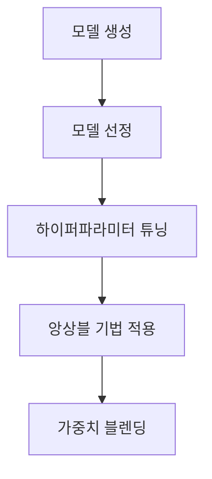

# 데이터 사이언티스트 포트폴리오 
> "데이터를 통해 인사이트를 발견하고, 가치를 창출합니다"

---

## 📊 프로젝트 개요

**소득 예측 AI 모델 개발 프로젝트**
- 🏆 **성과**: DACON 소득 예측 AI 해커톤 16등 (상위 1.3%, 총 1,200명 참가)
- ⏰ **기간**: 2024.03.11 ~ 2024.04.08
- 🎯 **목표**: 개인 특성 데이터를 활용한 소득 수준 예측 AI 모델 개발

---

## 💡 프로젝트 주요 내용

### 1. 데이터 분석 및 전처리

#### 1.1 데이터 정제
- 컬럼명 최적화
  - 공백 및 특수문자(`(`, `)`) 제거
  - 명확한 네이밍 규칙 적용
- 이상치 처리
  ```
  • Gains, Losses, Dividends 컬럼 제거 (Income과의 낮은 상관관계)
  • Income 이상치: 윈저화 방법 적용 (상하위 3% 기준)
  ```

#### 1.2 특성 공학
| 구분 | 세부 내용 |
|------|-----------|
| 범주화 | • 연령대별 구분 (`Range_of_Age`)</br> • 직업/산업 재분류 (`Industry_new`, `Occupation_new`) |
| 데이터 변환 | • 시민권/출생국가 이진화 (`US` / `Non-US`)</br> • 교육상태 간소화 (`Final_Education_Status`) |
| 인코딩 | • Frequency Encoding: 편향된 범주형 변수</br> • One-hot Encoding: 일반 범주형 변수 |

### 2. 모델링 프로세스



#### 2.1 모델 선정 및 최적화
- **선정 모델**: XGBoost, LightGBM, Catboost
- **최적화 방법**:
  - K-Fold 교차 검증
  - Optuna를 활용한 하이퍼파라미터 튜닝
  - 앙상블 기법 (Stacking, Voting)
  - Weighted Blending

---

## 🚀 핵심 성과 및 인사이트

### ✨ 주요 성과
1. 1,200명 중 16등 달성 (상위 1.3%)
2. 효과적인 Feature Engineering을 통한 모델 성능 향상
3. 앙상블 기법과 가중치 블렌딩을 통한 예측 정확도 개선

### 💡 프로젝트 인사이트
- **데이터 처리**
  - 윈저화 방법을 통한 이상치 처리 효과 검증
  - Frequency Encoding을 통한 편향성 감소
- **모델링**
  - Stacking이 Voting보다 우수한 성능 도출
  - 성능 기반 가중치 블렌딩의 효과성 입증

### 🎓 학습 및 개선점
- **성공 요인**
  ```
  • GPT 활용을 통한 효율적인 분석 프로세스
  • 다양한 앙상블 기법 시도 및 검증
  • 체계적인 하이퍼파라미터 최적화
  ```
- **개선 필요사항**
  ```
  • 이상치 처리 방법론 다각화
  • 더 다양한 모델 검증 필요
  ```

---

## 🛠 사용 기술 및 도구

- **언어**: Python
- **라이브러리**: 
  - 모델링: XGBoost, LightGBM, Catboost
  - 데이터 처리: Pandas, NumPy
  - 시각화: Matplotlib, Seaborn
- **도구**: 
  - 버전관리: Git
  - 개발환경: Jupyter Notebook
  - AI 도구: ChatGPT, GPTs

---


## 프로젝트 개요
- **기간**: 2024.03.11 ~ 2024.04.08
- **목적**: 개인 특성 데이터 기반 소득 수준 예측 AI 모델 개발
- **성과**: 1,200명 중 16위 달성


*데이터 초기 분포 분석*

## 데이터 전처리 및 Feature Engineering
- 이상치 처리: 윈저화 방법(상하위 3%) 적용
- Feature Engineering: 대륙별 분류, 연령대 범주화
- 인코딩: Frequency Encoding, One-hot Encoding 적용

| 전처리 전 | 전처리 후 |
|:---:|:---:|
|  |  |
*이상치 처리 전후 비교*

## 모델링 프로세스


- 주요 모델: XGBoost, LightGBM, CatBoost
- K-Fold 교차 검증으로 과적합 방지
- Weighted Blending으로 최종 성능 향상

*앙상블 모델 성능 비교*

## 핵심 성과
- ChatGPT와 GPTs 활용한 효율적인 개발
- 실제 데이터 기반 End-to-End 프로젝트 경험
- 앙상블 기법과 가중치 모델 실전 적용
